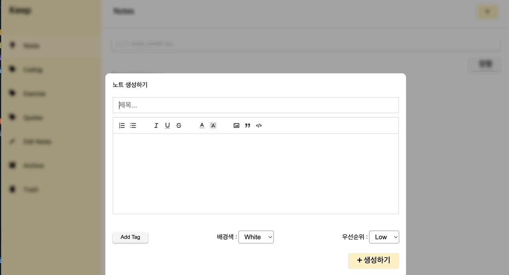

>
[**👉 배포 페이지 바로가기**](https://sj70.github.io/note_app/)

# 07. 리액트를 이용해서 노트 앱 만들기

### 수행기간

● 3일

---
### 결과물

● 제출해야 하는 결과물은 아래와 같습니다.

● 아래 링크 (그림 1)의 리소스 형상(manifest)이 올라간 결과물 레포 주소 (URL 제출)

---
### 하위과제

● 리덕스와 같은 상태 관리 라이브러리를 이용해서 상태를 관리합니다.

● 타입스크립트를 이용합니다.